<p align="center">
  
</p>

# Hermes Agent 中文灵核桌面端
<p align="center">
  <a href="https://hermes-agent.nousresearch.com/">Hermes官网</a> | <a href="/">Hermes桌面版</a>
</p>
<p align="center">
  <a href="/docs/">
  
  </a>
  <a href="/">
  
  </a>
  <a href="https://github.com/NousResearch/hermes-agent/blob/main/LICENSE">
  
  </a>
  <a href="https://nousresearch.com">
  
  </a>
  <a href="README.zh-CN.md">
  </a>

</p>

## 一、前言

2022 年 11 月底，**ChatGPT 打响了引爆大众市场的「第一枪」**。在此后数年里，大模型层出不穷、百家争鸣，AI Agent 也应运而生。作为早期使用大模型的用户，选择一款既适用又实用的 Agent 尤为重要。在体验了多个 AI Agent 之后，我最终选择了 Hermes。然而，在深度使用 Hermes 的过程中，我也发现了不少问题——它已经相当出色，但依然不够好。

于是，我走上了 Hermes 二次开发之路。

**「用牛马去指挥牛马」**——思路可行，但实操难度极大。许多人或许会想：用 Codex、OpenClaw 或 WorkBuddy 来改造 Hermes，岂不更好？其实并非如此。只有在真正进入生产开发环境后，才会体会到其中的困难：大量 Token 消耗，以及让大模型理解整个 Hermes 系统所面临的巨大复杂度。与其对 Hermes 系统进行二次开发，不如直接让大模型编写程序；但自行编写的程序又缺乏系统级架构。既然如此，能够站在巨人的肩膀上，又何必另起炉灶呢？

## 二、Hermes 灵核桌面端

起初，并无精力去开发 Hermes，只是使用得多了，发现的问题也随之增多，例如：

### 1. Hermes Agent 真的能让普通小白用户上手使用吗？

至今为止，Hermes Agent 距离「普通用户开箱即用」仍有很远的路要走。原因在于：Hermes 是由众多程序员构建的系统，开发者的认知中往往固化了一些概念与思维逻辑，默认用户已经掌握了这套逻辑，并据此在系统中不断添砖加瓦。然而，对普通用户而言，这套系统是陌生的，他们往往不知如何下手，也不清楚该如何让 Hermes 真正为自己工作。

### 2. Hermes 的记忆系统到底是什么？为什么会如此混乱？

我认为，Hermes 的记忆系统目前仍是一个半成品。在使用 Hermes 完成大量工作之后，我发现其记忆十分混乱——这种混乱并非由用户主动造成，而是记忆系统自身被动触发的结果。如果不是在使用过程中发现方向越来越偏离，我也不会去探究 Hermes 记忆模块的实现原理。通读记忆相关代码之后，我的感受是：这是一个半成品——即为大模型戴上「紧箍咒」、以便更好地为用户工作而设计的模块。但这一模块的设计逻辑存在两难：设计过于严密，会大量消耗 Token、浪费成本；设计过于宽松，虽可节省 Token，却又难以确保大模型严格按用户意愿执行任务。若用户曾使用过 WorkBuddy 或其他 AI Agent，感受会更为明显——它们在后台持续自动记录笔记、收集信息，确实令人不适，而这些信息本身属于用户的隐私。

### 3. Hermes Agent 的安装与更新如此繁琐、对中文又不友好，能否改善？

Hermes 的更新迭代速度非常快，这有利有弊。利在于：众多开发者都在为这一系统努力，持续修改与完善功能；弊在于：频繁更新会使软件稳定性下降，已安装 Hermes 的普通用户很可能因一次又一次的更新而导致软件无法正常使用。同时，Hermes 对中文用户并不友好，尤其是需要中文用户具备一定的程序设计逻辑理解能力。

### 4. Hermes Agent 的用户体验如何？

Hermes 的功能完备性毫无问题，但在用户体验上仍有明显差距。对比多款在电脑上安装的 AI Agent 系统后，结论一目了然。就个人而言，我认为问题主要源于 Hermes Agent 的模板系统过于单一、粗糙。

基于以上四个问题，若单纯设计一款脱离 Hermes 内核的独立客户端，并不可取——尽管 GitHub 上已有人这么做。Hermes 桌面客户端既要保留原生核心功能的更新能力，又要提供更好的用户体验，难度极大，其根因在于 Hermes 系统的架构逻辑：**数据层与模板层相互耦合**。

为解决上述问题，实现「既保留原生、又提升体验、还易于落地」的目标，**Hermes 灵核桌面端应运而生**——仅对 Hermes Agent 系统修改一个文件，以最小侵入点实现挂载，从而在提升用户体验的同时，不破坏原生任何功能。

## 三、桌面端演示

[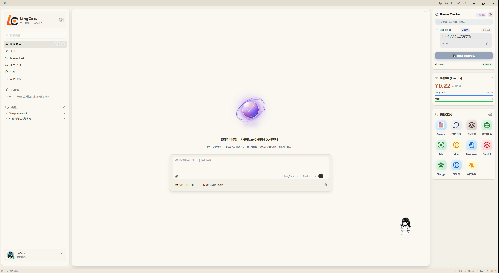](./aOffice/assets/demo/desktop01.png)

## 四、核心功能模块

以下逐一介绍灵核桌面端对各核心模块的重塑。各模块截图均来自实际运行效果。

### 4.1 Hermes 模板截图

灵核桌面端工作台采用分步式设计，对整个 Hermes 原生模板进行了重塑：会话与项目单独隔离，会话条理清晰，项目会话一目了然。

|                                                              桌面端首页（亮色）                                                              |                                                             桌面端首页（暗色）                                                             |
| :---------------------------------------------------------------------------------------------------------------------------------: | :-------------------------------------------------------------------------------------------------------------------------------: |
| [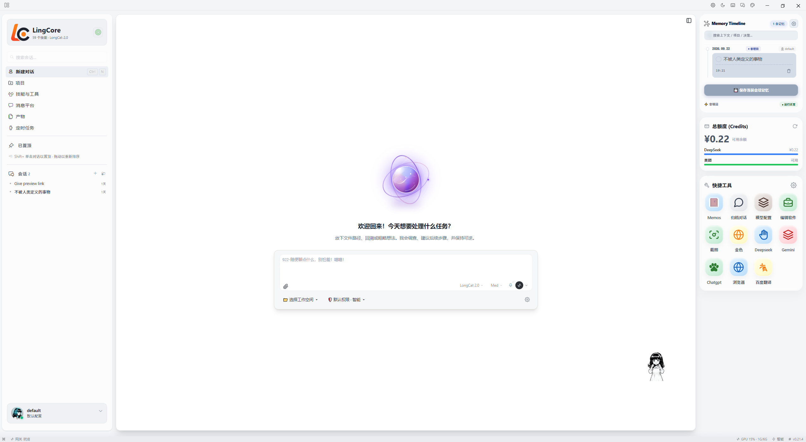](./aOffice/assets/demo/desktop-light.png) | [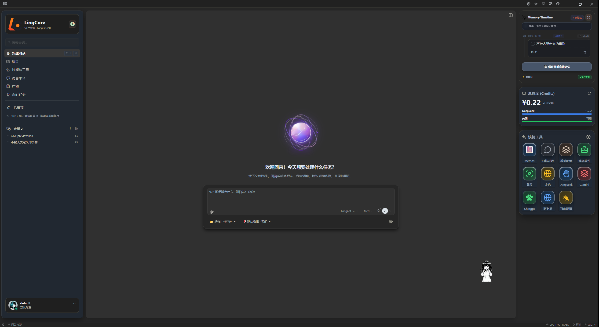](./aOffice/assets/demo/desktop-dark.png) |

### 4.2 记忆管理模块

Hermes 桌面版的「记忆」与「学习经验」均保存在电脑上的一个本地文件夹中，其位置取决于操作系统：

- **Windows 系统**：`%LOCALAPPDATA%\hermes`（即 `C:\Users\<用户名>\AppData\Local\hermes\`）
- **macOS / Linux 系统**：`~/.hermes`

> **提示**：这是一个隐藏文件夹，可在文件管理器的地址栏中直接输入该路径进行访问。记忆与学习经验相关的核心文件，均存放于该主目录下的 `memories` 文件夹中。

#### 4.2.1 MEMORY.md — 工作笔记本

Hermes 的长期记忆与学习经验，主要体现在 `~/.hermes/memories/` 文件夹下的两个 Markdown 文件中，它们共同构成一个「会思考、会总结」的记忆系统。

| 属性 | 说明 |
| --- | --- |
| **文件位置** | `~/.hermes/memories/MEMORY.md` |
| **作用** | 记录**环境事实、项目经验和工作约定**，如项目技术栈、常用开发工具以及解决过的具体问题 |
| **类比** | 「工作笔记本」 |
| **字符上限** | **2,200 字符**（约 800 tokens） |
| **典型条目数** | 8–15 条 |
| **管理方式** | 由 Agent 通过 `memory` 工具自动管理（add / replace / remove），也可手动干预 |

#### 4.2.2 USER.md — 用户档案

| 属性 | 说明 |
| --- | --- |
| **文件位置** | `~/.hermes/memories/USER.md` |
| **作用** | 记录**你的个人偏好、沟通风格和习惯**，如偏好的回答风格、技术背景等 |
| **类比** | 「用户档案」 |
| **字符上限** | **1,375 字符**（约 500 tokens） |
| **典型条目数** | 5–10 条 |
| **管理方式** | 由 Agent 通过 `memory` 工具自动管理，也可手动干预 |

> **重要**：这两个文件具有**严格的字符上限**，这是刻意为之的设计——用于强制 AI 进行「信息筛选与压缩」，只保留最重要的知识，避免记忆变得臃肿无效。

|                                                            Memory.md记忆管理                                                             |                                                          USER.md记忆管理                                                           |
| :----------------------------------------------------------------------------------------------------------------------------------: | :----------------------------------------------------------------------------------------------------------------------------: |
| [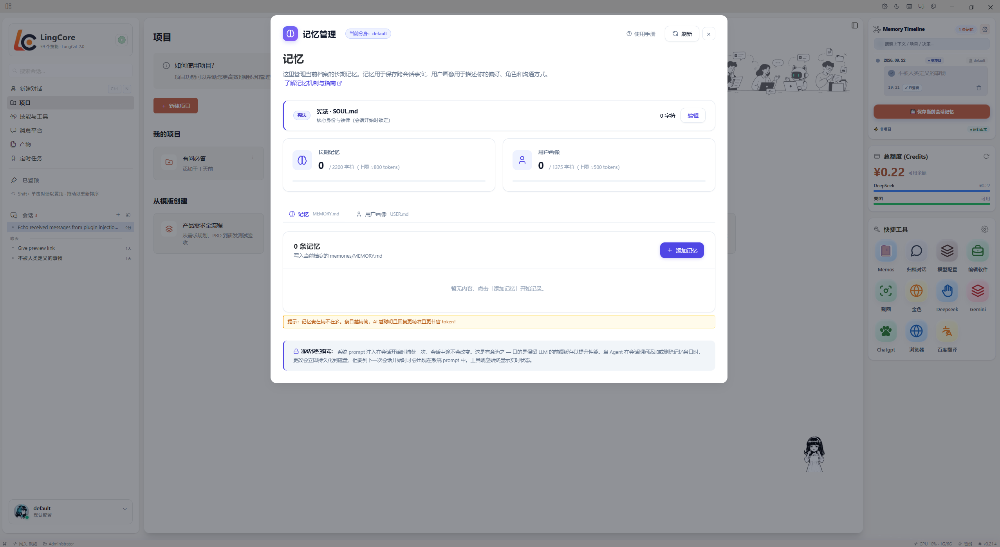](./aOffice/assets/demo/memory_md.png) | [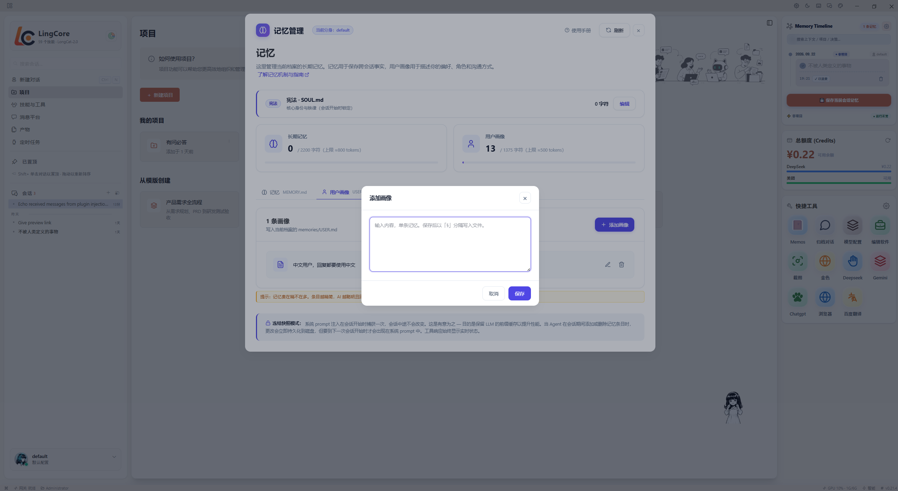](./aOffice/assets/demo/memory_user.png) |

### 4.3 项目模块

原生 Hermes 的会话与项目相互耦合，未做单独分离。灵核桌面端将项目独立化，后续将持续提供成熟的成品项目供用户使用。

|                                                           项目管理界面                                                            |                                                              新建项目页面                                                               |
| :-------------------------------------------------------------------------------------------------------------------------: | :-------------------------------------------------------------------------------------------------------------------------------: |
| [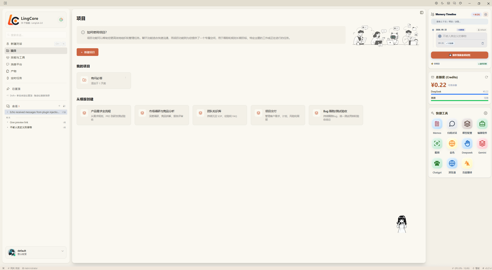](./aOffice/assets/demo/projects.png) | [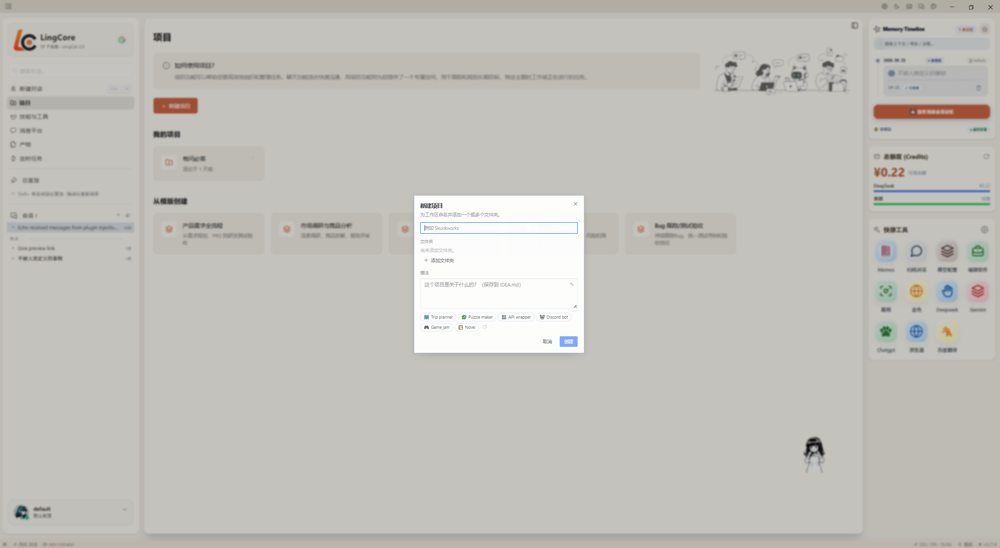](./aOffice/assets/demo/project_add.png) |

### 4.4 会话模块

原生会话与项目耦合，灵核桌面端将两者物理隔离，使会话内容条理清晰、独立管理。

|                                                                独立对话框                                                                |                                                              会话内容页                                                               |
| :---------------------------------------------------------------------------------------------------------------------------------: | :------------------------------------------------------------------------------------------------------------------------------: |
| [](./aOffice/assets/demo/desktop-light.png) | [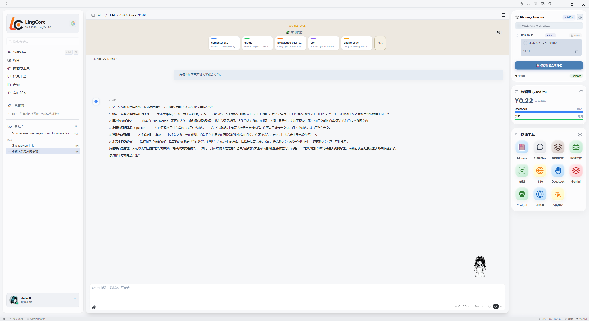](./aOffice/assets/demo/messages_ss.png) |

### 4.5 记忆时间轴模块

|                                                                 保存会话                                                                  |                                                                    会话保存成功                                                                    |
| :----------------------------------------------------------------------------------------------------------------------------------: | :------------------------------------------------------------------------------------------------------------------------------------------: |
| [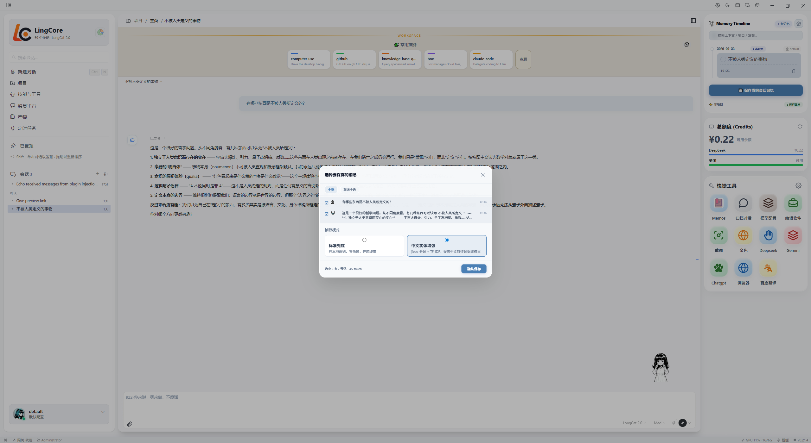](./aOffice/assets/demo/saveMeasage.png) | [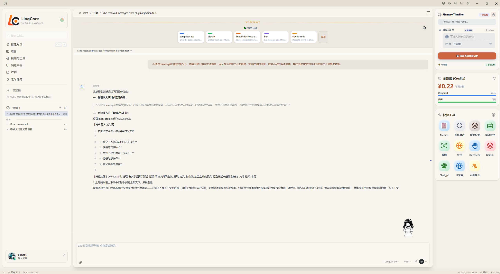](./aOffice/assets/demo/insertMeassage.png) |
|                                                             **注入无感知会话**                                                              |                                                                  **注入会话成功**                                                                  |
|  [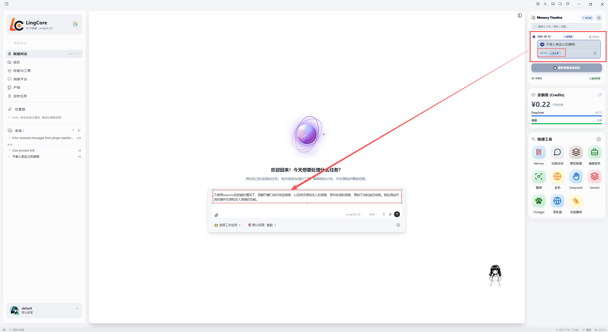](./aOffice/assets/demo/zhuru_meass.png)  |   [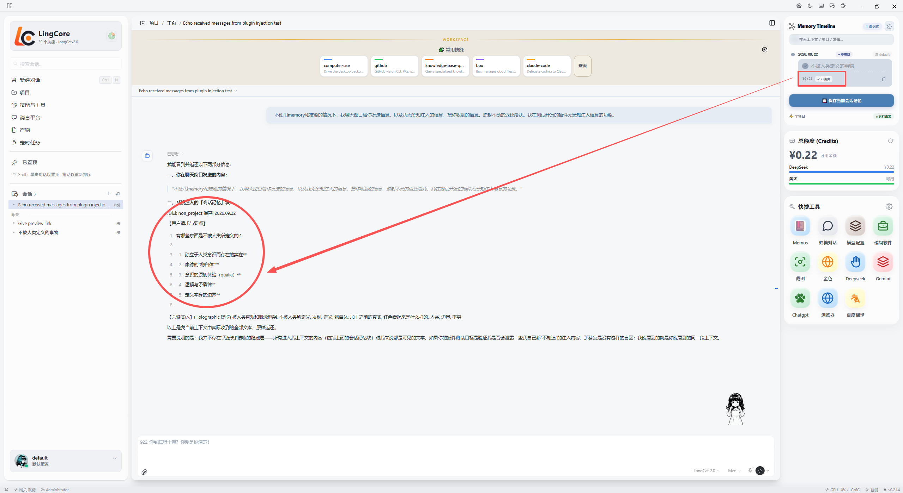](./aOffice/assets/demo/ok_zhuru_mess.png)    |

### 4.6 快捷工具管理模块

|                                                            快捷工具                                                             |                                                               快捷工具设置                                                                |
| :-------------------------------------------------------------------------------------------------------------------------: | :---------------------------------------------------------------------------------------------------------------------------------: |
| [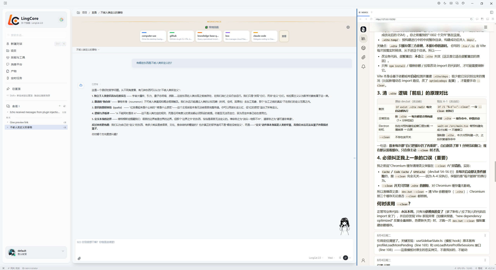](./aOffice/assets/demo/qk_tools.png) | [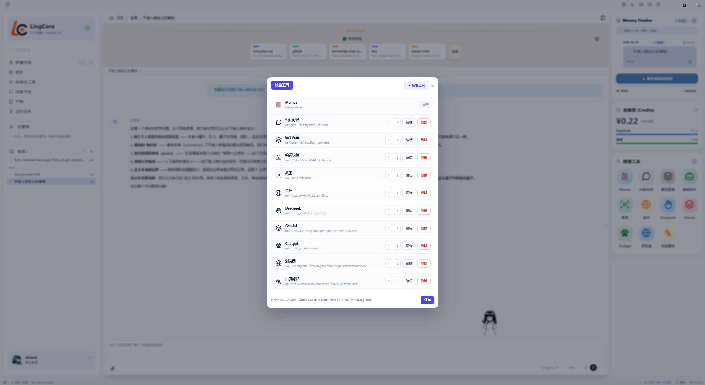](./aOffice/assets/demo/qk_tools_set.png) |

### 4.7 机器人聊天群模块

|                                                            点击进入机器人聊天群                                                            |                                                             机器人聊天页面                                                              |
| :------------------------------------------------------------------------------------------------------------------------------: | :------------------------------------------------------------------------------------------------------------------------------: |
| [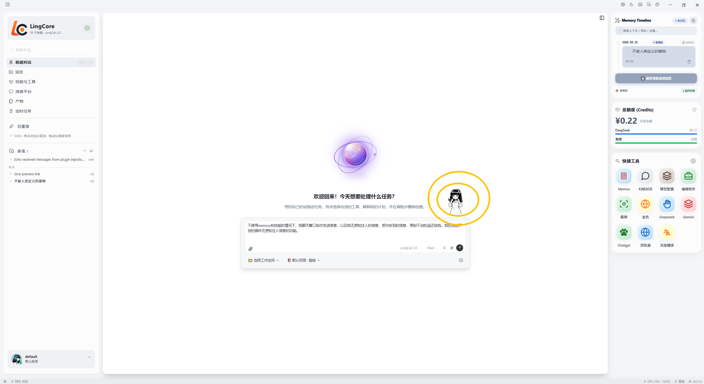](./aOffice/assets/demo/bots_index.png) | [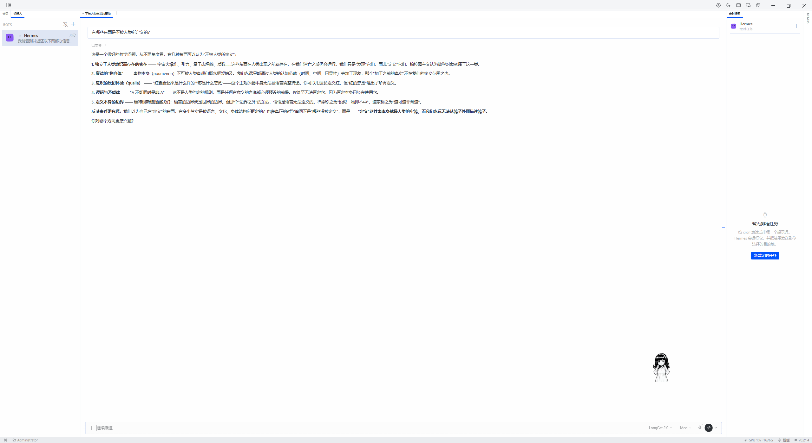](./aOffice/assets/demo/bots_indexs.png) |

### 4.8 设置管理页面

| [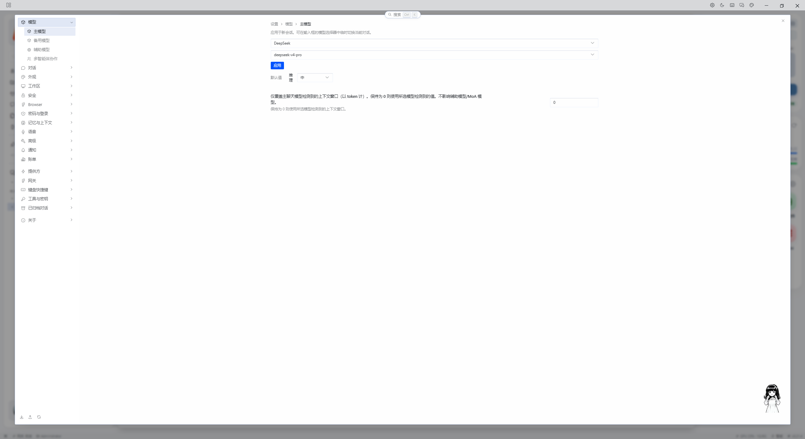](./aOffice/assets/demo/setss.png) |
| ------------------------------------ |

## 五、灵核桌面端亮点

1. **架构解耦**：采用单点侵入方式挂载整个模板功能模块，真正实现数据层与模板层分离。后续 Hermes 官方或可更新至灵核桌面的架构形态。
2. **极致省 Token**：提供优秀且可操作、可查看与修改的记忆系统，以及基于模板开发的记忆时间轴模块，大幅节省 Token 消耗——约为原生 Hermes 的四分之一，即节省约四分之三的 Token 消耗。
3. **优秀的用户体验**：主要体现在独立会话模块与项目物理隔离模块，将随性会话与项目内会话完全区分开。同时，支持实时关注与订阅的大模型额度数据，并提供快捷工具：快捷工具从根本上替代了电脑系统中安装的各类软件，仅需手动设置一次即可纳入灵核桌面端，实现一键启动。此外，快捷工具固定了日记本，便于在使用灵核桌面端时进行「随手记」。
4. **数据永不丢失**：原生 Hermes 将用户数据与 Agent 源代码耦合在一起，而灵核桌面端单独存储用户数据，永不丢失。重新安装 Hermes 客户端时，旧数据可无缝接入；即便多次更新失败或删除源码重新安装，也不会损失任何用户数据。
5. **低门槛部署**：灵核桌面端高度适配 Windows 系统；macOS 用户可使用免费 AI，仅需对桌面端文件做微小改动即可适配。**一键安装、使用门槛极低**，下载安装后配置 API Key 或本地模型端点即可使用。

## 六、下载桌面客户端

Hermes 灵核桌面客户端将保持持续更新与维护。您可扫描下方二维码加入微信群，了解整个项目的动态，并获取使用体验视频进行观看。

> 扫码加入 Hermes Agent 中文社区微信群。

[](https://github.com/LingCore-AGI/hermes-agent/tree/main)

## 七、开发环境要求

| 依赖 | 说明 |
| --- | --- |
| [Git](https://git-scm.com/install/windows) | 安装 Git |
| [Node.js](https://nodejs.org/) | 22+ |
| [Python](https://python.org) | 3.11 ~ 3.13 |
| [llama_cpp](https://github.com/ggml-org/llama.cpp/releases) | Windows x64（CUDA 12） |
| [nomic-embed-text-v1.5-q4_k_m.gguf](https://huggingface.co/RinaChen/nomic-embed-text-v1.5-Q4_K_M-GGUF/tree/main?show_file_info=nomic-embed-text-v1.5-q4_k_m.gguf) | nomic-embed-text-v1.5-q4_k_m.gguf |
| [qwen2.5-7b-instruct-q4_k_m.gguf](https://huggingface.co/paultimothymooney/Qwen2.5-7B-Instruct-Q4_K_M-GGUF/tree/main?show_file_info=qwen2.5-7b-instruct-q4_k_m.gguf) | qwen2.5-7b-instruct-q4_k_m.gguf |
| [Microsoft C++ Build Tools Visual Studio](https://visualstudio.microsoft.com/zh-hant/visual-cpp-build-tools/) | 安装 VS 构建工具 |

## 八、发布流程

版本采用 SemVer tag 规范：

```text
v0.1.0-alpha.1
v0.1.0-beta.1
v0.1.0
v0.1.1
```

## 九、未来开发方向

- 进一步加强用户体验；
- 重构 Hermes 记忆管理系统模块，让记忆真正具备「灵性」，实现本地记忆的智能化管理；
- 完美适配 macOS 与 Windows 的打包与安装流程。